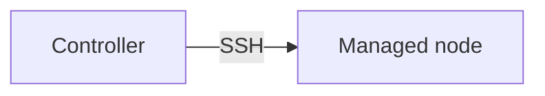

<div align="center">

# Shehawey Blog

A personal Linux blog — hand-written **articles**, structured **tutorial tracks**,
and a community **Q&A** — built with the Next.js App Router.

[](https://nextjs.org)
[](https://www.typescriptlang.org)
[](https://tailwindcss.com)
[](https://supabase.com)
[](#-pwa--offline)

**Live:** [shehaweyblog.vercel.app](https://shehaweyblog.vercel.app)

</div>

> 📖 **صاحب الموقع؟** اقرأ **[SETUP.md](./SETUP.md)** — دليل مفصّل بالعربية لكل ما تحتاجه لتشغيل الموقع وإعداد Supabase.

---

## ✨ Features

- **Articles** — 30+ hand-written Markdown articles with syntax-highlighted code,
  auto table of contents, reading time, related-articles suggestions, and RSS.
- **Tutorial tracks** — 10 multi-lesson tracks (Ansible, Docker, Git, Linux
  administration, system programming, and more) with per-track ordered lessons
  and prev/next navigation.
- **Mermaid diagrams** — any <code>```mermaid</code> fenced block in an article
  or lesson renders as a live diagram, and keeps working **offline** (see
  [Mermaid diagrams](#-mermaid-diagrams)).
- **Q&A system** — signed-in users can ask (admin-reviewed) and answer
  (published instantly, multiple answers per question), with replies, upvotes,
  tags, search, and in-app + email notifications.
- **Auth** — GitHub, Google, and email magic-link sign-in via Supabase, with
  public user profiles at `/u/[username]`.
- **Privacy by construction** — the "ask anonymously" guarantee is enforced by
  Postgres Row Level Security, not just the UI, and covered by an integration test.
- **Installable PWA** — full offline support via a service worker that precaches
  the whole sitemap, with new-version and new-content prompts.
- **Bilingual content, English UI** — the site chrome is always English, while
  each article renders in its own language (LTR/RTL, correct font) from its
  frontmatter `locale`.
- **SEO** — dynamic `sitemap.xml` / `robots.txt`, `Article` / `QAPage` JSON-LD,
  per-page Open Graph images (`next/og`), and privacy-respecting analytics.

## 🧱 Tech stack

| Area | Choice |
| --- | --- |
| Framework | Next.js 16 (App Router, TypeScript) |
| Styling | Tailwind CSS v4, dark mode by default (no-flash, cookie-based) |
| Content | Markdown files → `unified` / `remark` / `rehype` + [Shiki](https://shiki.style) (dual light/dark), sanitized HTML |
| Diagrams | [Mermaid](https://mermaid.js.org) v11, rendered client-side |
| Backend | Supabase (Postgres + Row Level Security, Auth, Storage) |
| Fonts | Inter (UI/English), IBM Plex Sans Arabic (Arabic), JetBrains Mono (code) |
| Hosting | Vercel |

## 📚 Content overview

Articles live as flat Markdown files; tutorials are grouped into tracks.

```
content/
├── articles/        one .md file per article (filename = URL slug)
└── tutorials/
    ├── <track>/_index.md   track metadata
    └── <track>/<lesson>.md  one ordered lesson each
```

**Tutorial tracks:** Ansible · Docker · Git & GitHub · Linux administration ·
Linux desktop setup · System programming · Raspberry Pi interfacing · Scripts ·
QEMU · Yocto.

## 🚀 Getting started

**Prerequisites:** Node.js 18.18+ (Next.js 16 requirement) and a Supabase
project (free tier is enough).

```bash
# 1. Install dependencies
npm install

# 2. Configure environment
cp .env.example .env.local   # then fill in your Supabase credentials

# 3. Run the dev server
npm run dev                  # http://localhost:3000
```

Other scripts:

```bash
npm run build      # production build
npm start          # serve the production build
npm run lint       # ESLint
npm run test:rls   # privacy integration test (needs a live Supabase project)
```

> 💡 **Filesystem note:** build the project on a POSIX filesystem (ext4/APFS).
> NTFS/FUSE mounts can break Next.js builds with a `SIGBUS` on `mmap`.

### Environment variables

| Variable | Required | Description |
| --- | --- | --- |
| `NEXT_PUBLIC_SUPABASE_URL` | ✅ | Supabase project URL |
| `NEXT_PUBLIC_SUPABASE_ANON_KEY` | ✅ | Supabase anon (public) key |
| `SUPABASE_SERVICE_ROLE_KEY` | ✅ | Service-role key (server-only; seed/import scripts) |
| `NEXT_PUBLIC_SITE_URL` | ✅ | Canonical site URL, no trailing slash |

See [`.env.example`](./.env.example) for the template.

## 🗄️ Supabase setup

The database schema, `questions_public` privacy view, RLS policies, and triggers
all live in [`supabase/migrations/`](./supabase/migrations). Run each migration
**in order, once each, in full**, via the Supabase SQL Editor:

1. Fill in your Supabase URL + anon + service-role keys in `.env.local`.
2. Apply `0001_init.sql` → `0010_email_notifications.sql` in order.
3. Enable the GitHub and Google providers under **Authentication → Providers**.
4. After your first sign-in, promote yourself to admin:
   ```sql
   update public.profiles set role = 'admin' where username = 'your-username';
   ```
5. (Optional) Seed the FAQ archive: `node scripts/seed-faq.mjs` (idempotent).

The full, step-by-step walkthrough (in Arabic, written for the site owner) — including the
Resend email-notification setup — is in **[SETUP.md](./SETUP.md)**.

## ✍️ Authoring content

### Add an article

Create `content/articles/your-slug.md` — the **filename becomes the URL slug**
(lowercase, hyphens, no spaces) — and start it with frontmatter:

```markdown
---
title: "Your Article Title"
description: "One or two sentences shown in lists and search results."
date: 2026-07-17
tags: [arch, pipewire]
locale: en          # or `ar` for a right-to-left Arabic article
draft: false        # `true` hides it from the live site (dev-only)
author: abdallah-shehawey
---

Your content here. Headings, lists, tables, links and fenced code blocks are
all supported and syntax-highlighted automatically.
```

Then `git commit` + `git push` — Vercel rebuilds and publishes automatically.

### Add a tutorial lesson

Add a `.md` file to the relevant `content/tutorials/<track>/` folder (or create a
new track folder with an `_index.md`). Lessons are ordered by their frontmatter
`order` and share the track's sidebar and prev/next navigation.

## 📊 Mermaid diagrams

Write a fenced `mermaid` code block in any article or lesson and it renders as a
diagram on the client:

````markdown

````

Supported types include flowcharts, sequence diagrams, class/state diagrams, and
more. Because Mermaid code-splits each diagram type into its own lazily-loaded
chunk, the app **warms those chunks while online** — rendering a hidden diagram
of each type so the service worker caches them — so diagrams still render when
the reader is **offline**. See
[`src/lib/warm-mermaid.ts`](./src/lib/warm-mermaid.ts).

## 📴 PWA & offline

The app installs as a PWA and works offline:

- On first load the service worker ([`public/sw.js`](./public/sw.js)) precaches
  the core shell, then the whole sitemap in the background (with a progress
  indicator), so every page is available offline.
- Runtime caching is network-first for pages and cache-first for immutable,
  content-hashed build assets (JS/CSS/fonts).
- Users are prompted when a new app version or new content is available.

## 🧪 Testing

```bash
npm run test:rls
```

The mandatory privacy test creates a throwaway user and an anonymous published
question, then verifies that querying `questions_public` as an anonymous client
never returns `author_id` (or any identifying field), and that the raw
`questions` table is unreachable by anon. RLS can't be meaningfully mocked, so
this runs as a real integration test against your Supabase project.

## 🚢 Deployment

Deployed on **Vercel**. Push to the default branch and Vercel rebuilds and
publishes automatically. Set the four environment variables above in the Vercel
project settings before the first deploy.

## 📁 Project structure

```
content/          articles (flat) and tutorial tracks (folders)
public/           icons, web manifest, service worker (sw.js)
scripts/          import-tutorials, seed-faq, and other one-off maintenance scripts
supabase/         SQL migrations (schema, RLS, views, triggers)
tests/            RLS privacy integration test (vitest)
src/
├── app/          App Router routes (home, articles, tutorials, Q&A, auth, admin, SEO)
├── components/   UI (readers, cards, forms, theme, service-worker register, …)
└── lib/          data layer (articles, tutorials, questions), Markdown pipeline, Supabase clients
```

## 📄 License

This is a personal project. The source code is provided as-is; the written
articles and tutorial content remain © their author. If you'd like to reuse any
part of it, please open an issue.
