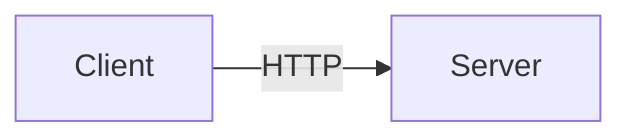

<div align="center">

# shehaweyblog — Linux Blog & Q&A Platform

A modern Linux technical blog, structured tutorial platform, and community Q&A engine built with **Next.js 16**, **Supabase**, and **Tailwind CSS**.

[](https://nextjs.org)
[](https://www.typescriptlang.org)
[](https://tailwindcss.com)
[](https://supabase.com)
[](#-pwa--offline)

**Live Demo:** [shehaweyblog.vercel.app](https://shehaweyblog.vercel.app)

</div>

> 📖 **Setup Guide**: See **[SETUP.md](./SETUP.md)** for a detailed step-by-step setup and Supabase migration guide (written in Arabic).

---

## ✨ Features

- **Articles** — Markdown-based articles with syntax-highlighted code blocks, automatic Table of Contents, estimated reading time, related content recommendations, and RSS feeds.
- **Tutorial Tracks** — Multi-lesson tutorial series (Ansible, Docker, Git, Linux Administration, System Programming, Yocto, etc.) with lesson ordering and track navigation.
- **Mermaid Diagrams** — Live client-side rendering for ````mermaid ```` fenced blocks with offline caching support (see [Mermaid Diagrams](#-mermaid-diagrams)).
- **Community Q&A System** — Authenticated users can ask (admin-moderated) and answer questions with nested replies, upvoting, tagging, search, and real-time + email notifications.
- **Authentication & User Profiles** — Supabase Auth (GitHub, Google, Email Magic Link) with public user profile pages (`/u/[username]`).
- **Privacy by Architecture** — Anonymous question submission guaranteed at the PostgreSQL database level using Row Level Security (RLS) views.
- **Installable PWA** — Offline access supported via Service Worker precaching and sitemap caching.
- **Bilingual Support (EN / AR)** — English UI chrome with native support for both English (LTR) and Arabic (RTL) articles with language-specific typography.
- **SEO & Social Optimization** — Dynamic `sitemap.xml`, `robots.txt`, dynamic OpenGraph images (`next/og`), and `Article`/`QAPage` JSON-LD structured data.

## 🧱 Tech Stack

| Area | Technology |
| --- | --- |
| **Framework** | Next.js 16 (App Router, TypeScript) |
| **Styling** | Tailwind CSS v4, dark mode by default (cookie-based theme state) |
| **Content Pipeline** | Markdown → `unified` / `remark` / `rehype` + [Shiki](https://shiki.style) (dual light/dark themes) |
| **Diagrams** | [Mermaid](https://mermaid.js.org) v11 (client-side rendered & precached) |
| **Backend & Auth** | Supabase (PostgreSQL + RLS, Auth, Storage) |
| **Typography** | Inter (UI/English), IBM Plex Sans Arabic (Arabic), JetBrains Mono (Code) |
| **Deployment** | Vercel |

## 📚 Content Structure

Articles are managed as flat Markdown files, while tutorials are grouped into tracks:

```
content/
├── articles/           # Flat directory of Markdown articles (filename = URL slug)
└── tutorials/
    ├── <track>/_index.md    # Track metadata
    └── <track>/<lesson>.md  # Ordered track lessons
```

**Supported Tutorial Tracks:** Ansible · Docker · Git & GitHub · Linux Administration · Linux Desktop Setup · System Programming · Raspberry Pi Interfacing · Shell Scripting · QEMU · Yocto.

## 🚀 Getting Started

### Prerequisites

- **Node.js**: `v18.18+` (Next.js 16 requirement)
- **Package Manager**: `npm`
- **Supabase Project**: Free tier or self-hosted Supabase instance

### Local Setup

```bash
# 1. Clone the repository
git clone https://github.com/abdallah-shehawey/shehaweyblog.git
cd shehaweyblog

# 2. Install dependencies
npm install

# 3. Configure environment
cp .env.example .env.local   # Fill in Supabase keys & site URL

# 4. Run the development server
npm run dev                  # Available at http://localhost:3000
```

### Available Scripts

| Script | Action |
| --- | --- |
| `npm run dev` | Start development server |
| `npm run build` | Build application for production |
| `npm start` | Serve production build |
| `npm run lint` | Run ESLint static analysis |
| `npm run test:rls` | Run Vitest integration test for Supabase RLS privacy rules |

> 💡 **Filesystem Note:** Build the project on a POSIX filesystem (`ext4` / `APFS`). NTFS/FUSE mounts can cause Next.js build crashes (`SIGBUS` on `mmap`).

### Environment Variables

| Variable | Required | Description |
| --- | --- | --- |
| `NEXT_PUBLIC_SUPABASE_URL` | ✅ | Supabase project URL |
| `NEXT_PUBLIC_SUPABASE_ANON_KEY` | ✅ | Supabase anon (public) key |
| `SUPABASE_SERVICE_ROLE_KEY` | ✅ | Service role key (server-only; used for seed scripts) |
| `NEXT_PUBLIC_SITE_URL` | ✅ | Canonical site URL (e.g. `http://localhost:3000` or production domain) |

See [`.env.example`](./.env.example) for template.

## 🗄️ Database & Supabase Setup

Database schema, security policies, and triggers are versioned under [`supabase/migrations/`](./supabase/migrations):

1. Copy `.env.example` to `.env.local` and set your Supabase API credentials.
2. Execute migration files in order (`0001_init.sql` through `0010_email_notifications.sql`) in the Supabase SQL Editor.
3. Enable GitHub and Google OAuth providers in **Authentication → Providers**.
4. Promote an initial user to admin:
   ```sql
   UPDATE public.profiles SET role = 'admin' WHERE username = 'your-username';
   ```
5. (Optional) Seed initial FAQ entries: `node scripts/seed-faq.mjs`.

For a full step-by-step walkthrough, refer to **[SETUP.md](./SETUP.md)**.

## ✍️ Content Authoring

### Adding an Article

Create a Markdown file under `content/articles/your-slug.md` with YAML frontmatter:

```markdown
---
title: "Article Title Here"
description: "Brief summary for search results and social previews."
date: 2026-07-17
tags: [linux, devops]
locale: en          # Use 'en' for LTR English or 'ar' for RTL Arabic
draft: false        # Set to true to restrict to local development
author: username    # Must match an author username or defaults to site owner
---

Article body in Markdown...
```

### Adding a Tutorial Lesson

Add a `.md` file inside `content/tutorials/<track-name>/`. Specify `order: <number>` in the frontmatter to define lesson sequence within the track.

## 📊 Mermaid Diagrams

Mermaid diagrams can be written directly in Markdown fenced code blocks:

````markdown

```

Diagrams are rendered client-side and pre-cached by the Service Worker to allow full offline rendering support. See [`src/lib/warm-mermaid.ts`](./src/lib/warm-mermaid.ts).

## 📴 PWA & Offline Support

- Service Worker ([`public/sw.js`](./public/sw.js)) precaches application shell assets and sitemap pages.
- Network-first strategy for dynamic content; cache-first for static build assets.
- Built-in UI notifications for update availability and offline status.

## 🧪 Security & Integration Testing

Run Row Level Security (RLS) integration tests:

```bash
npm run test:rls
```

Verifies that querying `questions_public` anonymously never exposes user identity data and that sensitive tables remain protected by RLS rules.

## 🚢 Deployment

Optimized for deployment on **Vercel**:

1. Push repository to GitHub/GitLab.
2. Import project into Vercel.
3. Configure Environment Variables (`NEXT_PUBLIC_SUPABASE_URL`, `NEXT_PUBLIC_SUPABASE_ANON_KEY`, `SUPABASE_SERVICE_ROLE_KEY`, `NEXT_PUBLIC_SITE_URL`).
4. Deploy.

## 📁 Project Structure

```
content/          # Markdown articles & tutorial tracks
public/           # Icons, web app manifest, Service Worker (sw.js)
scripts/          # Maintenance, seeding, and import scripts
supabase/         # PostgreSQL migrations (RLS, views, functions)
tests/            # Vitest RLS security integration tests
src/
├── app/          # Next.js App Router pages, APIs, and layouts
├── components/   # React UI components
└── lib/          # Markdown parser, Supabase clients, and data utilities
```

## 📄 License

This project is open-source and available under the [MIT License](LICENSE).
