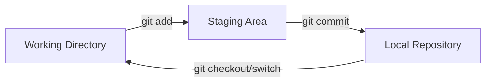

Welcome! This guide is a complete reference for **Git**, the distributed version control system. It covers everything from the absolute basics to advanced recovery techniques, designed for beginners, students, and professionals.

> **Note:** This guide focuses purely on **Git** (the local tool), not GitHub/GitLab (hosting services).

## What is Git?

Git is a **Distributed Version Control System (VCS)**. It is often humorously described by its creator as:

> **"A cranky old man"** — created by **Linus Torvalds** (creator of Linux) in 2005.

It tracks changes, saves history (Time Machine), and enables teamwork without overwriting code.

## First Time Setup

Before using Git, you must introduce yourself. This information is embedded in every commit.

```bash
git config --global user.name "Your Name"
git config --global user.email "your@email.com"
git config --list
```

## The Core Concept (critical)

Understanding these three areas is the key to mastering Git.



1. **Working Directory:** Where you currently edit files. (Status: _Modified_ or _Untracked_)

2. **Staging Area:** The "Waiting Room" for the next snapshot. (Status: _Staged_)

3. **Local Repository:** The database where history is stored. (Status: _Committed_)

## Basic Workflow

### Initialize & Status

```bash
git init        # Start a new repo
git status      # Check modified/staged files (Most Used!)
git ls-files    # List all tracked files in staging area
```

### Add & Commit

```bash
git add filename.c      # Add specific file
git add .               # Add ALL changed/new files
git commit -m "Message" # Save snapshot
```

### Deleting Files (two Methods)

How to remove a file from the project properly:

- **Method A: The Git Way (Recommended)**

    ```bash
    git rm filename.txt   # Deletes file AND stages the deletion
    git commit -m "Deleted file"
    ```

- **Method B: The Manual Way** If you delete the file manually (Right-click -> Delete), Git sees it as a change. You must "add" the deletion:

    ```bash
    git add filename.txt  # Stages the deletion
    git commit -m "Deleted file"
    ```

## Ignoring Files (.gitignore)

Create a file named `.gitignore` in your root folder. List files you **don't** want Git to track (e.g., build artifacts, passwords).

**Example `.gitignore` content:**

```text
# Ignore all .o and .exe files
*.o
*.exe

# Ignore the build directory
/build
/node_modules

# Ignore environment variables (passwords)
.env
```

_Note:_ If a file is already tracked, adding it to `.gitignore` won't stop Git from tracking it. You must `git rm --cached <file>` it first.

## Viewing History & Diffs

### Log (history)

```bash
git log                         # Full history
git log --oneline --graph --all # Visual tree (Best for overview)
git show <commit-id>            # See exactly what changed in a specific commit
```

### Diff (comparing Changes)

|Command|What it compares|
|---|---|
|`git diff`|**Working Dir** vs **Staging** (Unstaged changes)|
|`git diff --cached`|**Staging** vs **Last Commit** (What will be committed)|
|`git diff HEAD`|**Working Dir** vs **Last Commit** (All changes)|

## Undoing Changes & Cleaning Up

### Discard Changes (working Directory)

_I edited a file but want to cancel changes._

```bash
# Modern Way
git restore filename.txt
git restore .            # Discard all local changes

# Old Method
git checkout filename.txt
```

### Unstage Files (staging Area)

_I added a file to staging but want to remove it from staging._

```bash
# Modern Way
git restore --staged filename.txt

# Old Method
git reset filename.txt
```

### Clean Untracked Files

_Remove new files/folders that haven't been added to Git yet._

```bash
git clean -dn    # Dry run (Show what will be deleted)
git clean -df    # Force delete untracked files/folders
```

### Resetting Commits (time Travel)

_Undo commits. Assuming `HEAD~1` is the previous commit._

|Command|Effect|
|---|---|
|`git reset --soft HEAD~1`|Undoes commit. Changes go to **Staging Area**. (Great to fix commit).|
|`git reset HEAD~1` (Mixed)|Undoes commit. Changes go to **Working Dir**. (Great to keep work).|
|`git reset --hard HEAD~1`|**DANGER.** Deletes commit and **destroys all changes**.|

### Fixing the Last Commit (--amend)

_I committed but forgot a file OR made a typo in the message._

```bash
git add forgotten_file.c          # Add the file you missed
git commit --amend -m "New Msg"   # Updates the last commit
```

### Safe Undo (revert)

_I want to undo a commit but preserve history (Safe for public branches)._

```bash
git revert <commit-id>   # Creates a NEW commit that does the opposite of the bad commit
```

## Branching, Merging & Strategies

### Branch Management

```bash
git branch                 # List branches
git branch <name>          # Create branch
git branch -d <name>       # Delete branch (Safe)
git branch -D <name>       # Force delete branch
```

### Switching & Checkout (the Nuance)

- **`git checkout <id>`**: Moves to specific commit -> **"Detached HEAD"**.

- **`git switch <name>`**: Switches to a branch.

- **`git switch -c <name>`**: Creates AND switches to a new branch.

- **`git checkout -`**: Jumps to the previous branch (Like Alt+Tab).

### Merging & Strategies

To merge `dev` into `main`, you must be on `main`:

```bash
git switch main
git merge dev
```

**Merge Types:**

1. **Fast-Forward:** Linear history (no fork).

2. **Non-Fast-Forward (ORT/Recursive):** Creates a **Merge Commit**.

## Stashing (the "pause" Button)

Save uncommitted work to a stack so you can switch branches.

```bash
git stash                   # Save changes
git stash push -m "msg"     # Save with a custom message (Best Practice)
git stash list              # Show all saved stashes
```

**Restoring Stashes:**

```bash
git stash apply             # Restore most recent stash (keeps it in list)
git stash apply 2           # Restore stash index 2 (from stash list)
git stash pop               # Restore AND remove from list
```

**Deleting Stashes:**

```bash
git stash drop 2            # Delete specific stash
git stash clear             # Delete ALL stashes
```

## Working with Remotes (online)

Connecting your local repo to GitHub/GitLab.

```bash
git clone <url>             # Download a project from the internet
git remote add origin <url> # Link existing local repo to remote URL
git remote -v               # Check linked URLs
```

**Syncing:**

```bash
git fetch                   # Download changes but DO NOT merge them
git pull                    # Download AND merge changes (fetch + merge)
git push origin main        # Upload your commits to the server
```

## Tags (releases)

Mark specific points in history as important (e.g., v1.0).

```bash
git tag v1.0                # Create a lightweight tag
git tag                     # List tags
git push origin v1.0        # Push tag to remote (tags don't push automatically)
```

## Advanced: Rewriting History

### Cherry-pick

Take a specific commit from another branch and apply it to your current branch.

```bash
git cherry-pick <commit-id>
```

### Rebase (linear History)

**Scenario:** Re-align `dev` on top of `main` to keep history straight.

```bash
git switch dev
git rebase main
```

- **Warning:** Commits get new IDs. Never rebase public/shared branches!

## Emergency Recovery (reflog)

`git reflog` records **every** move you make. It is your safety net.

### Scenario 1: Recovering a Deleted Commit (hard Reset)

You did `git reset --hard` and lost code.

1. `git reflog` -> Find the ID (SHA) of the commit before the reset.

2. `git reset --hard <commit-id>`

### Scenario 2: Recovering a Deleted Branch

You deleted `feature-x` but want it back.

1. `git reflog` -> Find the ID of the last commit on that branch.

2. **Method A (Direct):**

    ```bash
    git branch feature-x <commit-id>
    ```

3. **Method B (Checkout & Switch):**

    ```bash
    git checkout <commit-id>
    git switch -c feature-x
    ```
